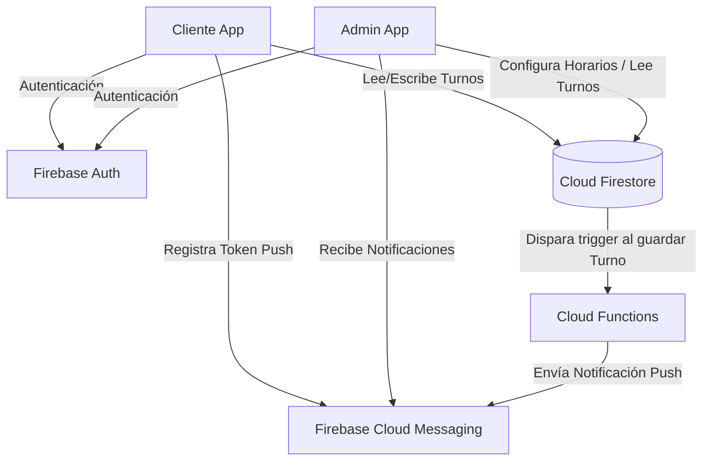

# Diagrama de Módulos: App D'Shaddai

Este documento detalla la estructura modular de la aplicación Flutter para D'Shaddai, siguiendo un enfoque de arquitectura basada en características (Feature-First) que facilita la escalabilidad y el mantenimiento a largo plazo.

## Arquitectura a Nivel de Sistema

## Diagrama de Módulos Internos (Flutter)

A continuación se muestra cómo se estructurarán las carpetas y los módulos dentro del proyecto de Flutter:

```mermaid
graph TD
    subgraph Core [Core Module]
        Theme[Theme & Design System]
        Router[App Router]
        Utils[Constants & Utils]
        FirebaseCfg[Firebase Configuration]
        PushSvc[Push Notifications Service]
    end

    subgraph Data [Data Layer / Repositories]
        AuthRepo[Auth Repository]
        UserRepo[User Repository]
        BookRepo[Booking Repository]
        ConfigRepo[Config Repository]
    end

    subgraph Features [Feature Modules]
        subgraph AuthFeature [Auth]
            LoginView[Google Login View]
            PhoneCapture[WhatsApp Capture View]
        end
        
        subgraph HomeFeature [Home]
            LandingInfo[Salon Info View]
        end
        
        subgraph BookingFeature [Client Booking]
            ClientCalendar[Client Calendar View]
            SlotSelection[Time Slots Generator]
            Confirmation[Booking Confirmation]
        end
        
        subgraph AdminFeature [Admin Dashboard]
            AdminTabs[Admin Navigation]
            CalendarSettings[Calendar Settings View]
            BookingsList[All Bookings List]
        end
    end

    %% Data Dependencies
    LoginView -.-> AuthRepo
    LoginView -.-> PushSvc
    PhoneCapture -.-> UserRepo
    ClientCalendar -.-> BookRepo
    ClientCalendar -.-> ConfigRepo
    SlotSelection -.-> ConfigRepo
    Confirmation -.-> BookRepo
    CalendarSettings -.-> ConfigRepo
    BookingsList -.-> BookRepo
    BookingsList -.-> UserRepo
    
    %% Core Dependencies
    Features ==> Core
```

### Descripción de los Módulos

#### 1. Core Module
Contiene la base y configuración global de la aplicación.
- **Theme & Design System:** Definirá todos los colores corporativos (hueso, dorado, verde oliva), tipografías y estilos de botones.
- **App Router:** Encargado de la navegación (por ejemplo usando `go_router`).
- **Firebase Configuration:** Archivos iniciales generados por FlutterFire.
- **Push Notifications Service:** Servicio encargado de pedir permisos al sistema operativo, obtener el token FCM del dispositivo y manejar la recepción de notificaciones push entrantes.

#### 2. Data Layer (Capa de Datos)
Encapsula toda la lógica de comunicación directa con Firebase, separando la base de datos de las vistas.
- **AuthRepository:** Maneja la autenticación con Google y Firebase Auth.
- **UserRepository:** Gestiona los perfiles de los usuarios en Firestore (rol, número de WhatsApp, estado de bloqueo y token FCM).
- **BookingRepository:** Permite guardar nuevos turnos, buscar los turnos de una clienta o listar todos para el admin.
- **ConfigRepository:** Lee y actualiza el documento de configuración del salón (horas de apertura, días laborables, duración del turno).

#### 3. Feature Modules (Capa de Presentación y Lógica UI)
- **Auth:** Pantallas de validación e ingreso. Aquí se guarda el token FCM de la clienta al registrarse, habilitando futuras campañas promocionales.
- **Home:** La pantalla principal donde estará la información pública.
- **Client Booking:** La interfaz de reserva. Aquí es donde el módulo de `Time Slots Generator` lee la configuración del admin y los turnos existentes para pintar solo los horarios disponibles.
- **Admin Dashboard:** Pantallas exclusivas para el administrador, protegidas por la validación del rol. Incluye la capacidad de bloquear clientes.
